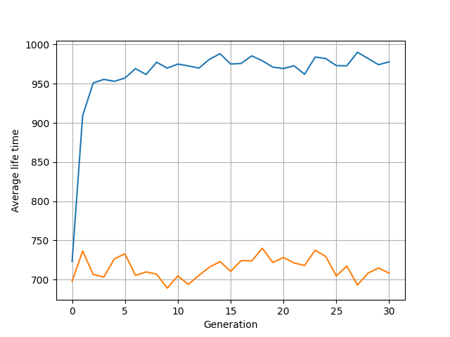

# Integrantes do grupo
- Nome: Alexia Pires

- Nome: Enzo Zamberlam

- Nome: João Gabriel Valentim Rocha

# Steering Behaviors
Em 1980, o cientista da computação Craig Reynolds desenvolveu algoritmos de comportamento de direção utilizando animações. Em seus trabalhos, constaram estratégias de navegação de objetos em um meio virtual. Isso permitiu que a computação dos dias de hoje desenvolvesse algoritmos cada vez mais complexos, um dos seus trabalhos mais famosos são os "Boids", a simulação se aproxima do movimento de passáros e cardumes.

Nesse contexto, utilizamos o conceito de veículos introduzido pelo paper “Steering Behaviors for Autonomous Characters” (1999) de Craig Reynolds, para descrever agentes autônomos.

Nesse sentido, os veículos (clássicos) serão determinados como uma classe cujos atributos são:
- Vetor posição
- Vetor velocidade
- Vetor aceleração

# Algoritmos genéticos
Tendo em vista os veículos citados anteriormente, utilizaremos seus conceitos para gerar uma aplicação de optimização utilizando algoritmos genéticos. Isso envolve os seguinte passos

> 1) Cria a geração

> 2) Seleção

> 3) Crossover

> 4) Mutação

## Reinforcement Learning
O Aprendizado por reforço será vinculado ao algoritmo genético para que os veículos tenham estímulos do que pode ser benéfico e maléfico. Nesse sentido, foi implementado que os veículos podem se alimentar de comida ou veneno, para cada veículo foi atribuido uma lista que representa o DNA daquele indivíduo cujos elementos são os pesos que eles terão de prepensão de serem atraídos ou repelidos pela comida ou pelo veneno.

Note que os indivíduos que serão atraídos pelo veneno deverão ser eliminados no precesso de seleção natural, bem como os que serão repelidos pela comida. Para isso, cada veículos também possui vida que será gasta a medida com que o tempo passa ou quando ele come veneno e será incrementada a medida com que ele come comida.

## Validação
Para validar o modelo e ver que os veículos estão de fato aprendendo, fizemos duas simulações, uma utilizando o algoritmo genético (segue os processos descritos acima) e uma utilizando um algoritmo aleatório (insere DNA's aleatórios nos veículos). Para tanto, utilizamos como fit a média do tempo de vida dos veículos como parâmetro de ordem (eixo Y, em unidade de tempo arbitrárias), e o número da geração no parâmetro de controle (eixo x).

### Gráfico de validação:

## Conclusões
Tendo em vista que o nosso modelo é coerente com a realidade e mostra resultados, é possível aplicar esse tipo de algoritmo para múltiplos tipos de problemas, como aplicação em jogos eletrônicos e aplicação em rôbos autônomos que precisam descrever trajetórias específicas (como estacionar um carro).

## Bibliografia

- V. MNIH. Playing Atari with Deep Reinforcement Learning, Deep Mind, ArXiv, 2013. https://arxiv.org/pdf/1312.5602v1.pdf.

- V. MNIH. Human-level control through deep reinforcement learning, Nature 2015. https://storage.googleapis.com/deepmind-data/assets/papers/DeepMindNature14236Paper.pdf.

- GÉRON, A. Hands-on Machine Learning with Scikit-Learn, Keras and TensorFlow. Concepts, Tools and Techniques to Build Intelligent Systems, 2nd Ed, Páginas 437-470, 2019.

- SHIFFMAN, D. The Nature of Code. Simulating Natural Systems With Processing, 2012. https://natureofcode.com/book/

- CRAIG W. REYNOLDS. 1987. Flocks, herds and schools: A distributed behavioral model. SIGGRAPH Comput. Graph. 21, 4 (July 1987), 25–34. DOI:https://doi.org/10.1145/37402.37406

- CRAIG W. REYNOLDS. Steering Behaviors For Autonomous Characters. Game developers conference. 1999. http://www.red3d.com/cwr/steer/gdc99/

- SEDOL,L VS ALPHAGO. Google DeepMind Challenge Match: Lee Sedol vs AlphaGo. 2016.  https://www.youtube.com/watch?v=yCALyQRN3hw&t=22412s  

## Tecnologias usadas nesse projeto

